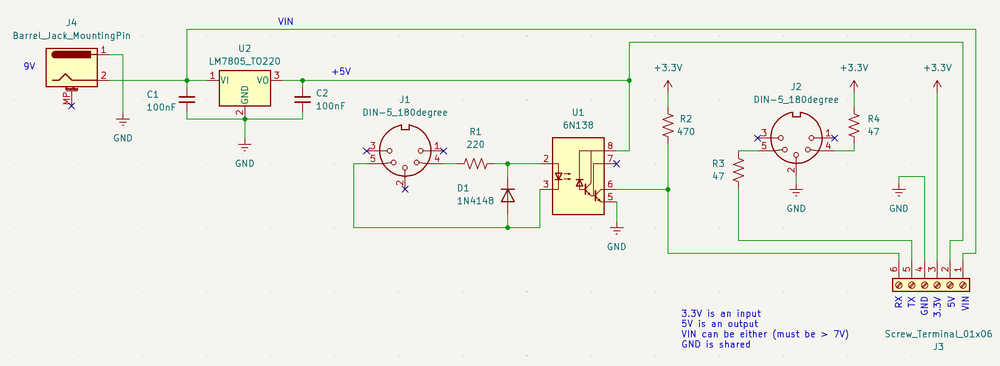
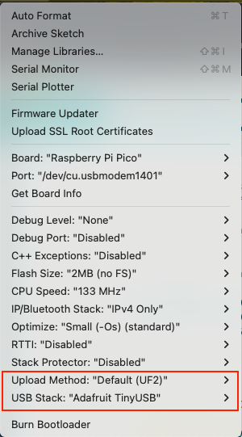

# stegosaurus

Stegoaurus is an open-source MIDI controller. The controller is built around the Arduino framework and uses the MIDI protocol to communicate with a computer. It is designed to be easily configurable, with the ability to change the behavior of the controller using SysEx messages. 

TODO:
- [x] Add hardware MIDI support to the Pico
- [x] Add SysEx support to the Pico
- [ ] Web interface for programming
    - [x] Basic interaction
    - [ ] Add SysEx messages
- [ ] EEPROM module
- [ ] Pinouts
## Project Structure

THis project is organized as follows:

- [`firmware/`](firmware/): main firmware code
- [`interface/`](interface/): code for the web interface

## Requirements

### Firmware

This project runs on the **Raspberry Pi Pico**.
To set it up in the Arduino IDE, follow [this guide](https://randomnerdtutorials.com/programming-raspberry-pi-pico-w-arduino-ide/). You will probably have to hold down the BOOTSEL button while plugging in the Pico to get it into bootloader mode for the first time. Pay attention to these upload settings:

.

Make sure the selected port matches the port that the Pico is connected to.

Required libraries:

- [EasyButton](https://github.com/evert-arias/EasyButton) (@v2.0.3)
- [Adafruit TinyUSB](https://github.com/adafruit/Adafruit_TinyUSB_Arduino) (@v3.1.4)

### Pinouts

### Interface

This will have to use WebMIDI to communicate with the Arduino.

A good first step for this is to get a list of MIDI devices. I want to do this in React.

## Interface for Programming

See [this page](https://learn.sparkfun.com/tutorials/midi-tutorial/advanced-messages) for a good reference on MIDI messages.

The Stegosaurus will use SysEx messages to change the behavior of the controller. 

The manufacturer ID for the USB MIDI SysEx messages is `0x00 0x53 0x4D`. The `0x00` indicates that the message has a vendor ID, and the `0x53 0x4D` is the ASCII representation of "SM". This is a unique identifier for the Stegosaurus MIDI controller (I think it is unique). So, if you see a message with this ID, it is likely from the Stegosaurus. The rest of the message is the actual data.

To program the controller behavior, the interface will send a SysEx message with the manufacturer ID, followed by the command byte, and then the data. Keep in mind that the SysEx message maximum length is 128 bytes. This is using this [here](https://github.com/FortySevenEffects/arduino_midi_library/wiki/Using-custom-Settings), but I don't think that any of the messages will be even close to that length.

## MIDI Messages

The Stegosaurus will use the following MIDI messages. Keep in mind that the first 4 bytes of the message are specific to the SysEx MIDI protocol. The rest of the message is the actual data. Every message is concluded with the SysEx end byte `0xF7`.

### Memory Layout
There are 128 presets, each with 16 slots.

#### Preset Layout

### Message Structure

The message is broken up into 2 parts: the header and the data. The header is the first 4 bytes of the message, and the data is the rest of the message.

Types of messages:
- Control change
- Program change
- Program get
- Variable set

**IMPORTANT**: 
| Saved to main memory |
|-----------------------|
| Control change        |
| Program change        |

#### Header

| Byte | Value                                                            |
|------|----------------------------------------------------------------------|
| 0 | 0xF0 (SysEx start) |
| 1 | 0x00 (Three-byte Vendor ID) |
| 2 | 0x53 (Vendor ID) |
| 3 | 0x4D (Vendor ID) |

#### Program Change

| Byte | Description    | Range |
|------|----------------|-------|
| 4    | Message type | 0x00 (Program Change) |
| 5    | Preset to modify | [0, 127] |
| 6    | Slot to modify | [0, 16] |
| 7    | Trigger  |  0x00 for preset entry, 0x01 for preset exit, 0x02 for switch short press, 0x03 for switch long press |
| 8    | Switch number and type (if trigger is 0x01 or 0x02). The left nybble is the switch number [0, 16], and the right nybble is the type (0x0 for momentary, 0x1 for toggle) | [0, 256] |
| 9   | MIDI channel   | [0, 15] |
| 10   | Program number | [0, 127] |

#### Control Change

Control change messages are called when bit 9 of the bookkeeping byte is set to 0x01. 

| Byte | Description    | Range |
|------|----------------|-------|
| 4    | Message type | 0x01 (Control Change) |
| 5    | Preset to modify | [0, 127] |
| 6    | Slot to modify | [0, 16] |
| 7    | Trigger  |  0x00 for preset entry, 0x01 for preset exit, 0x02 for switch short press, 0x03 for switch long press |
| 8    | Switch number and type (if trigger is 0x01 or 0x02). The left nybble is the switch number [0, 16], and the right nybble is the type (0x0 for momentary, 0x1 for toggle) | [0, 256] |
| 9   | MIDI channel   | [0, 15] |
| 10   | Control number | [0, 127] |
| 11  | Control value  | [0, 127] |

#### Program Get

This message is used to get the current information for a preset. This is useful for updating the interface with the current state of the controller.

| Byte | Description    | Range |
|------|----------------|-------|
| 4    | Message type | 0x02 (Program Get) |
| 5    | Preset to get | [0, 127] |

The data returned will be in the following format:

#### Variable Get/Set

This message is used to set a variable in the controller. This is useful for setting things like the LED brightness or the MIDI channel.
By convention, for boolean variables, a value of 0 is false and a value of 127 is true. This is done because the MIDI protocol for CC and PC messages only allows for values between 0 and 127.

| Byte | Description    | Range |
|------|----------------|-------|
| 4    | Message type | 0x03 (Variable Set) / 0x04 (Variable Get) |
| 5    | Variable name | [0, ] |
| 6    | Value | [0, 127] |

**Table of variable names and value ranges**

| Variable # | Variable Name | Value Range | Description |
|------------|---------------|-------------|-------------|
| 0x00       | LED Brightness | [0, 127] | Brightness of the LEDs |
| 0x01       | MIDI Channel | [0, 15] | MIDI channel for the controller |
| 0x02       | MIDI Thru | [0, 127] | MIDI Thru setting |

## Pico Notes

## TRASH

#### Teensy 4.0

[DEPRECATED]

This is currently built on a Teensy 4.0. It should also work with any ATMega32U4 board, such as the Arduino Micro, HOWEVER, the USB name on the Micro will show up as just "Arduino Micro". The firmware is written in C++ and uses the Arduino framework. 
Make sure you have the arduino IDE installed, and the Teensyduino add-on. See the [Teensyduino](https://www.pjrc.com/teensy/td_download.html) page for more information. The following libraries are required:

- [Arduino MIDI Library](https://github.com/FortySevenEffects/arduino_midi_library) (@v5.0.2)
- [Arduino USBMIDI](https://github.com/lathoub/Arduino-USBMIDI) (@v1.1.2)
- [EasyButton](https://github.com/evert-arias/EasyButton) (@v2.0.3)

You'll need to change the USB type to "Serial + MIDI" in the Arduino IDE. This is done by going to `Tools > USB Type` and selecting "Serial + MIDI".